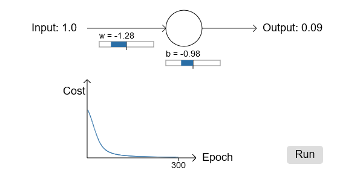

# 改进的Cost函数Cross-entropy使神经网络学习更快

> 我们理想的情况是神经网络Cost下降的很快
## 神经网络是如何学习的

举个例子：一个简单的神经网络模型:只有一个神经元，一个输入一个输出，类似如:

我们使用梯度下降算法来训练这个模型
> 神经网络学习过程(Cost的变化情况)

假设:输入为1,输出值为0

假设权重$\omega$我们设置为0.6,初始偏向b设置为0.9，初始预测的输出a=0.82,学习率为0.15,迭代学习300次:

[具体演示动画参考](http://neuralnetworksanddeeplearning.com/chap3.html#the_cross-entropy_cost_function)

神经网络快速的学习权重和偏向用来降低Cost，虽然最后训练结果和0有些偏差，但是0.09也是很好的结果了
> 改变初始权重和偏向,预计输出,我们在观察Cost函数的变化情况

如果我们改变神经元的初始权重和偏向，假设权重$\omega$我们设置为2.0,初始偏向b设置为2.0，初始预测的输出a= 0.98,学习率为0.15,迭代学习300次:

[具体演示动画参考](http://neuralnetworksanddeeplearning.com/chap3.html#the_cross-entropy_cost_function)

可以看出Cost函数一开始下降很慢，迭代到200次左右才开始出现明显的下降,而且最后输出值是0.2要比上一个例子0.09差很多。

### 为什么神经网络会出现一开始学习很慢后来学习变快的情况呢

<b>神经网络学习慢说明了偏导数$\partial C/\partial\omega$ 和 $\partial C/\partial b$比较小</b>

>回顾之前的Cost函数(二次Cost函数)
> $$C=\frac{(y-a)^{2}}{2}$$

> 上式中y是真实输出，a是相应的预测输出，$a=\sigma(z)$,z为中间变量($z=\omega x+b$),分别对$\omega$和$b$求偏导
> $$
\begin{eqnarray} 
  \frac{\partial C}{\partial w} & = & (a-y)\sigma'(z) x = a \sigma'(z) \\
  \frac{\partial C}{\partial b} & = & (a-y)\sigma'(z) = a \sigma'(z),
\end{eqnarray}
$$
