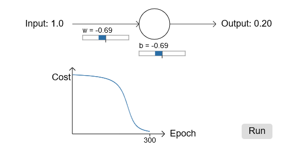
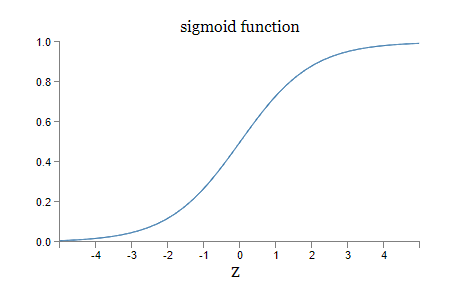
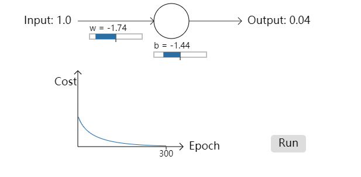
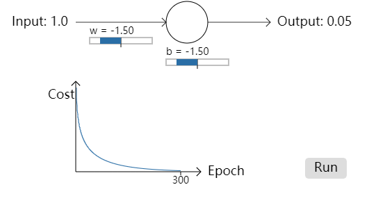

# 改进的Cost函数Cross-entropy使神经网络学习更快

> 我们理想的情况是神经网络Cost下降的很快
## 神经网络是如何学习的

举个例子：一个简单的神经网络模型:只有一个神经元，一个输入一个输出，类似如:

我们使用梯度下降算法来训练这个模型
#### 神经网络学习过程(Cost的变化情况)

假设:输入为1,输出值为0

假设权重$\omega$我们设置为0.6,初始偏向b设置为0.9，初始预测的输出a=0.82,学习率为0.15,迭代学习300次:

[具体演示动画参考](http://neuralnetworksanddeeplearning.com/chap3.html#the_cross-entropy_cost_function)

神经网络快速的学习权重和偏向用来降低Cost，虽然最后训练结果和0有些偏差，但是0.09也是很好的结果了
> 改变初始权重和偏向,预计输出,我们在观察Cost函数的变化情况

如果我们改变神经元的初始权重和偏向，假设权重$\omega$我们设置为2.0,初始偏向b设置为2.0，初始预测的输出a= 0.98,学习率为0.15,迭代学习300次:

[具体演示动画参考](http://neuralnetworksanddeeplearning.com/chap3.html#the_cross-entropy_cost_function)

可以看出Cost函数一开始下降很慢，迭代到200次左右才开始出现明显的下降,而且最后输出值是0.2要比上一个例子0.09差很多。

### 为什么神经网络会出现一开始学习很慢后来学习变快的情况呢

> <b>神经网络学习慢说明了偏导数$\partial C/\partial\omega$ 和 $\partial C/\partial b$比较小</b>

> 回顾之前的Cost函数(二次Cost函数)
 
 $$C=\frac{(y-a)^{2}}{2}$$

 上式中y是真实输出，a是相应的预测输出，$a=\sigma(z)$,z为中间变量($z=\omega x+b$),分别对$\omega$和$b$求偏导
 $$
\begin{eqnarray} 
  \frac{\partial C}{\partial w} & = & (a-y)\sigma'(z) x = a \sigma'(z) \text{（把x=1,y=0带入）}\\
  \frac{\partial C}{\partial b} & = & (a-y)\sigma'(z) = a \sigma'(z),
\end{eqnarray}
$$

>回顾下一开始用的激活函数sigmoid函数

学习速度取决于$a\sigma'(z)$,而$a$在{0,1}之间，所以$a$对学习速度影响较小。从图像中可以看出在神经元输出接近0或1的时候，曲线变的很平缓,这个时候$\sigma'(z)$小，所以学习速度很慢。
> 二次Cost函数的缺点

当神经元输出值接近0或1的时候，学习速度很慢，学习的速度跟参数的选择关系很大。

## 介绍cross-entropy 损失函数（cost function）

使用一个更加复杂的神经网络:
他有一个神经元，三个输入，一个输出

如图$\alpha = \sigma(z),\text{其中} z=\sum_j w_j x_j+b $

>定义新的损失函数cross-entropy如下：

$$\begin{eqnarray} 
  C = -\frac{1}{n} \sum_x \left[y \ln a + (1-y ) \ln (1-a) \right]
  \end{eqnarray}$$

把$\alpha = \sigma(z)$带入上式:
$$\begin{eqnarray} 
  C = -\frac{1}{n} \sum_x \left[y \ln\sigma(z) + (1-y ) \ln (1-\sigma(z)) \right]
  \end{eqnarray}$$

分别对$\omega \text{和}b$求偏导:
> 对$\omega$求偏导
$$\begin{eqnarray}
  \frac{\partial C}{\partial w_j} & = & -\frac{1}{n} \sum_x \left(
    \frac{y }{\sigma(z)} -\frac{(1-y)}{1-\sigma(z)} \right)
  \frac{\partial \sigma}{\partial w_j}\\
 & = & -\frac{1}{n} \sum_x \left( 
    \frac{y}{\sigma(z)} 
    -\frac{(1-y)}{1-\sigma(z)} \right)\sigma'(z) x_j\\
    & = & -\frac{1}{n}
  \sum_x \frac{\sigma'(z) x_j}{\sigma(z) (1-\sigma(z))}
  (\sigma(z)-y)\text{(合并同类项)}
\end{eqnarray}$$
根据sigmoid函数$\sigma(z) =
1/(1+e^{-z})$,对它求导得出$\sigma'(z) =
\sigma(z)(1-\sigma(z))$带入上式得出:
$$\begin{eqnarray} 
  \frac{\partial C}{\partial w_j} =  \frac{1}{n} \sum_x x_j(\sigma(z)-y)=\frac{1}{n} \sum_x x_j(a-y)\tag{1}\end{eqnarray}$$

>对b求偏导
$$
\begin{eqnarray} 
  \frac{\partial C}{\partial b} = \frac{1}{n} \sum_x (\sigma(z)-y)=\frac{1}{n} \sum_x (a-y)\tag{2}
\end{eqnarray}
$$

由(1)(2)两个式可以知道:
学习的快慢(即偏导数的大小)取决于a-y,即输出层的error

> cross-entropy函数的好处是:

错误大时,更新多,学得快. 错误小时,学习慢

#### 演示cross-entropy损失函数的学习情况

> 起始权重为0.6,偏向为0.9，其他都不变

[具体演示动画参考](http://neuralnetworksanddeeplearning.com/chap3.html#the_cross-entropy_cost_function)
可以看出，cross-entropy cost函数在一开始就学习的很快（曲线下降的很快），而且最后预测输出为0.04,非常接近0，比之前的二次Cost的效果（0.09）好很多。

> 起始权重和偏向都设置为2.0

[具体演示动画参考](http://neuralnetworksanddeeplearning.com/chap3.html#the_cross-entropy_cost_function)
## 总结:
cross-entropy cost几乎总是比二次cost函数好
如果神经元的方程是线性的, 用二次cost函数 (不会有学习慢的问题)