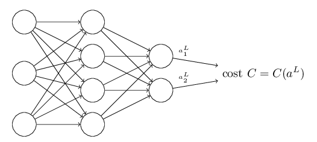
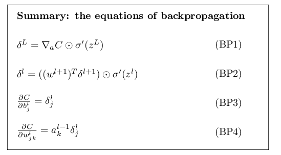

# backpropagation算法原理
-------------------------

> Backpropagation核心解决的问题: ∂C/∂w 和 ∂C/∂b 的计算, 针对cost函数C

> $\omega_{24}^{3}:$表示第从第(3-1)层的的第4个神经元到第3层的第2个神经元的权重weight 

> $b_{3}^{2}:$表示第2层的第3个神经元的偏向bais
-----
## 正向传播

###### 公式:$$\alpha_{j}^{l}=\sigma(\sum_{k}\omega_{jk}^{l}\alpha_{k}^{l-1}+b_{j}^{l})$$

>分为两步：
>1. $\omega\alpha+b$ 加权求和
>2. 对加权求和整体使用sigmoid函数求出下层的输出值 
##### 数据结构
> 对于每一层(l),定义一个权重矩阵     (weight matrix):$\omega^{l}$，这个权重矩阵包含当前层的所有神经元到前一层的所有神经元的权重
>> $\omega_{jk}^{l}:$表示第从第l层的的第j个神经元到第l-1层的第k个神经元的权重weight 

>对于每一层(l),定义一个偏向向量(bais vector):$b^{l}$
>> $b_{j}^{l}$则表示l层的第k个神经元的bais

>同理，对于$\alpha$：l层的神经元向量$\alpha^{l}$,每个神经元的值$\alpha_{j}^{l}$

> Vector a function: $\sigma(\upsilon)_{j} = \sigma(\upsilon_{j})$
> 例如：$f(x)=x^{2}$
> $f(\begin{bmatrix}2\\3\end{bmatrix})=\begin{bmatrix}f(2)\\f(3)\end{bmatrix}=\begin{bmatrix} 4\\9 \end{bmatrix}$
>则,可以由l层的每一个元素的计算公式可以退出该层矩阵运算的公式:$$\alpha_{j}^{l}=\sigma(\sum_{k}\omega_{jk}^{l}\alpha_{k}^{l-1}+b_{j}^{l})=>\alpha^{l}=\sigma(\omega^{l}\alpha^{l-1}+b^{l})$$
>其中$\sum_{k}\omega_{jk}^{l}\alpha_{k}^{l-1}$可以用$\omega_{j}^{l}\alpha_{k}^{l-1}$表示,即第l层权重矩阵的第j个行向量与前一层神经元的列向量进行内积的结果,令$z^{l}=\omega^{l}\alpha^{l-1}+b^{l}$，则$\alpha^{l}=\sigma(z^{l})$。
>简单点理解：对于每层正向传播,每层的值(向量形式)就是当前层的权重矩阵与上一层的值(向量)相乘再加上当前层的偏向(向量),然后统一使用sigmoid函数转化
--------------

## 关于Cost函数的两个假设:
>1. 
>$$C=\frac{1}{2n}\sum_{x}||y(x)-\alpha^{L}(x)||^{2}$$
>其中$\alpha^{L}(x)$表示输出层的真实值所组成的向量,$x$表示训练实例，n表示输出实例的个数。
> $C=\frac{1}{n}\sum_{x}C_{x}$(average cost)   
$C_{x}=\frac{1}{2}||y(x)-\alpha^{L}(x)||^{2}$(single instance cost)

>2. 我们对成本的第二个假设是它可以写​​成神经网络输出的函数：
>
$$C = \frac{1}{2} \|y-a^L\|^2 = \frac{1}{2} \sum_j (y_j-a^L_j)^2$$
>###### 介绍一个后面需要用到的公式
>The Hadamard product, s⊙t,向量对应元素相乘:
>$\begin{bmatrix}1\\2\end{bmatrix}⊙\begin{bmatrix}3\\4\end{bmatrix}=\begin{bmatrix} 1*3\\2*4 \end{bmatrix}=\begin{bmatrix}3\\8\end{bmatrix}$
--------------

## backpropagation4个重要公式

>定义在l层的第j个神经元的error:$\delta_{l}^{j}$

