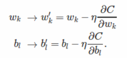

# backpropation算法python代码实现讲解

> 具体神经网络参见第一个笔记



#### 批量梯度更新
```python
class Network(object):
    ...
    # 参数，mini_batch:要批量更新的输入实例的集合;eta:学习率
    def update_mini_batch(self, mini_batch, eta):
    # nable_w、nable_b分别用来装对每层权重矩阵和偏向向量求的偏导数
        nabla_b = [np.zeros(b.shape) for b in self.biases]
        nabla_w = [np.zeros(w.shape) for w in self.weights]
        # x是输入实例，y是输出标签,对mini_batch的所有实例求偏导
        for x, y in mini_batch:
        # 通过backpropagation算法求出对权重和偏向的偏导数
            delta_nabla_b, delta_nabla_w = self.backprop(x, y)
            # 对所有实例的偏导数进行累加(因为是随机梯度下降)
            # nb:一层的偏向向量的累积和,nw一层的权重矩阵的累积和，dnb:一层的偏向向量的偏导数，dnw,一层的矩阵矩阵的偏导数
            nabla_b = [nb+dnb for nb, dnb in zip(nabla_b, delta_nabla_b)]
            nabla_w = [nw+dnw for nw, dnw in zip(nabla_w, delta_nabla_w)]
            # 随机梯度下降需要除mini_batch的size
        # 根据公式计算最后的每层的权重矩阵和偏向向量
        # weights:保存每层的权重矩阵，biases：保存每层的偏向向量
        self.weights = [w-(eta/len(mini_batch))*nw 
                        for w, nw in zip(self.weights, nabla_w)]
        self.biases = [b-(eta/len(mini_batch))*nb 
                       for b, nb in zip(self.biases, nabla_b)]

```

#### backpropagation算法
```python
class Network(object):
...
   def backprop(self, x, y):
        nabla_b = [np.zeros(b.shape) for b in self.biases]
        nabla_w = [np.zeros(w.shape) for w in self.weights]
        # feedforward（正向更新）
        # 输入层的activation
        activation = x
        # 用来存储神经网络每层的activation值(包括输入层，隐藏层，输出层)
        activations = [x] 
        # 一个list用来存储每层中间变量
        zs = []
        for b, w in zip(self.biases, self.weights):
            # 求出中间变量的值
            z = np.dot(w, activation)+b
            # 添加到list中
            zs.append(z)
            # 求出该层activation
            activation = sigmoid(z)
            # 添加到activations中
            activations.append(activation)
        # backward pass（反向更新参数）
        # 根据公式求出输出层的error
        delta = self.cost_derivative(activations[-1], y) * \
            sigmoid_prime(zs[-1])
        # 根据公式求出输出层的偏导数 dC/dw和dC/dw
        nabla_b[-1] = delta
        nabla_w[-1] = np.dot(delta, activations[-2].transpose())
        # 从倒数第二层向第二层反向更新
        for l in xrange(2, self.num_layers):
            # 中间变量，对应-l层的activation（注意-l）
            z = zs[-l]
            # 求出-l层激活函数导函数值
            sp = sigmoid_prime(z)
            # 根据公式计算出-l层的error
            delta = np.dot(self.weights[-l+1].transpose(), delta) * sp
            # 根据公式求出-l层的偏导数 dC/dw和dC/dw
            nabla_b[-l] = delta
            nabla_w[-l] = np.dot(delta, activations[-l-1].transpose())
        # 返回计算好的2-L层的所有对权重和偏向的偏导数
        return (nabla_b, nabla_w)
...
    # Cost对最后一层activation求导
    def cost_derivative(self, output_activations, y):
    # 根据Cost函数:cost = 1/2 * (y-a)^2，求导得出cost'= a-y
        return (output_activations-y) 
    # 激活函数
    def sigmoid(z):
        """The sigmoid function."""
        return 1.0/(1.0+np.exp(-z))
    # 激活函数的导函数
    def sigmoid_prime(z):
        return sigmoid(z)*(1-sigmoid(z))
```

#### backpropagation算法步骤
1. 输入$x$:设置输入层相应的activation $a^{1}$ 
2. 正向更新
    对于每层$l = 2, 3, \ldots, L$ 计算： 
    $$z^{l} = w^l a^{l-1}+b^l \quad \text{和}\quad  a^{l} = \sigma(z^{l})$$
3. 计算输出层的error $\delta^L$: 
    $$\delta^{L}= \nabla_a C \odot \sigma'(z^L)$$
4. 反向更新error(Backpropagate the error)
    对于每层 $l = L-1, L-2,\ldots,2$ 计算:
 $$\delta^{l} = ((w^{l+1})^T \delta^{l+1}) \odot
  \sigma'(z^{l})$$
5. 输出每层的偏导数($l = 2, 3,\ldots,L$)
更新公式：
  $$\frac{\partial C}{\partial w^l_{jk}} = a^{l-1}_k \delta^l_j \quad \text{和}\quad \frac{\partial C}{\partial b^l_j} = \delta^l_j$$.
6. 返回所有的偏导数(nabla_b,nabla_w)
